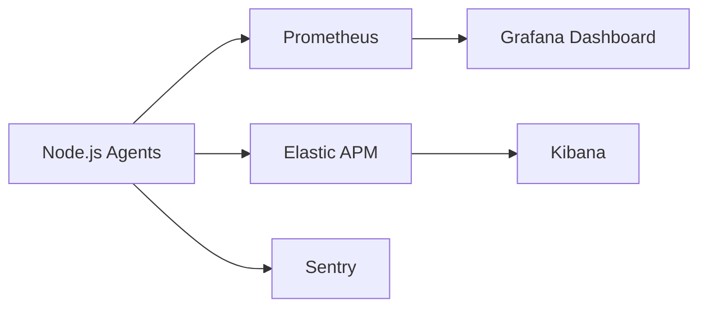

# Real-Time Messaging Architecture

> **DISCLAIMER**: This repository contains architecture documentation and sanitized examples. Production configurations, monitoring dashboards, and proprietary scaling solutions have been removed. This repository is not open for contributions yet.

## High-Performance Messaging Platform
Node.js backend handling 50,000 concurrent connections with <100ms end-to-end latency.

### Key Metrics
- **Uptime**: 99.995% over 18 months
- **Throughput**: 12,000 messages/second
- **Scale**: Horizontally to 100 nodes

## Reliability Features
- **Active-Active Regional Failover**: Automatic traffic rerouting during regional outages
- **Health Check System**: Multi-layer health verification (L4, L7, application logic)
- **Graceful Degradation**: Priority-based message delivery during overload
- **Predictive Scaling**: Forecast-based resource provisioning

## Monitoring Stack


## Failover Playbook
1. **Detection**: Automated anomaly detection (5σ deviation)
2. **Containment**: Traffic shedding and rate limiting
3. **Recovery**: Automated region failover within 90 seconds
4. **Post-Mortem**: Automated RCA report generation

## Getting Started
```bash
git clone https://github.com/ImRamis/realtime-messaging-architecture.git
cd realtime-messaging-architecture
npm install
npm run start:prod
```